# Inventario de imágenes

| ID | Vista | Título | Ubicación | Estado | Archivos |
|---|---|---|---|---|---|
| t01-m01-img01 |  | Mapa de transformación | P1 M1 | Publicada | [original](tema-01-introduccion/01_originales/pagina-09.jpg) · [recorte](tema-01-introduccion/02_recortes/t01-m01-img01-mapa-transformacion-recorte.jpg) · [web](tema-01-introduccion/03_web/t01-m01-img01-mapa-transformacion-web.webp) |
| t01-m02-img01 |  | Frasco con aceite | P1 M2 | Publicada | [original](tema-01-introduccion/01_originales/pagina-01.jpg) · [recorte](tema-01-introduccion/02_recortes/t01-m02-img01-frasco-aceite-recorte.jpg) · [web](tema-01-introduccion/03_web/t01-m02-img01-frasco-aceite-web.webp) |
| t03-m01-img01 |  | Anatomía de una semilla | P1 M1 | Publicada | [original](tema-03-semillas/01_originales/pagina-7.jpg) · [recorte](tema-03-semillas/02_recortes/t03-m01-img01-anatomia-semilla-recorte.jpg) · [web](tema-03-semillas/03_web/t03-m01-img01-anatomia-semilla-web.webp) |
| t03-m01-img02 |  | Diversidad de semillas | P1 M1 | Publicada | [original](tema-03-semillas/01_originales/pagina-8.jpg) · [recorte](tema-03-semillas/02_recortes/t03-m01-img02-diversidad-semillas-recorte.jpg) · [web](tema-03-semillas/03_web/t03-m01-img02-diversidad-semillas-web.webp) |
| t03-m02-img01 |  | Ejemplos de gimnospermas | P1 M2 | Publicada | [original](tema-03-semillas/01_originales/pagina-12.jpg) · [recorte](tema-03-semillas/02_recortes/t03-m02-img01-gimnospermas-recorte.jpg) · [web](tema-03-semillas/03_web/t03-m02-img01-gimnospermas-web.webp) |
| t03-m02-img02 |  | Ciclo de una conífera | P1 M2 | Publicada | [original](tema-03-semillas/01_originales/pagina-16.jpg) · [recorte](tema-03-semillas/02_recortes/t03-m02-img02-ciclo-conifera-recorte.jpg) · [web](tema-03-semillas/03_web/t03-m02-img02-ciclo-conifera-web.webp) |
| t03-m03-img01 |  | Monocotiledóneas y dicotiledóneas | P1 M3 | Publicada | [original](tema-03-semillas/01_originales/pagina-26.jpg) · [recorte](tema-03-semillas/02_recortes/t03-m03-img01-monocotiledoneas-dicotiledoneas-recorte.jpg) · [web](tema-03-semillas/03_web/t03-m03-img01-monocotiledoneas-dicotiledoneas-web.webp) |
| t03-m04-img01 |  | Germinación epígea e hipógea | P1 M4 | Publicada | [original](tema-03-semillas/01_originales/pagina-29.jpg) · [recorte](tema-03-semillas/02_recortes/t03-m04-img01-germinacion-recorte.jpg) · [web](tema-03-semillas/03_web/t03-m04-img01-germinacion-web.webp) |
| p01-m01-img01 |  | Frasco ámbar | P1 M1 | Publicada | [original](tema-01-introduccion/01_originales/pagina-01.jpg) · [recorte](tema-01-introduccion/02_recortes/t01-m02-img01-frasco-aceite-recorte.jpg) · [web](parte-01-la-gota/modulo-01/03_web/p01-m01-img01-frasco-ambar-web.webp) |
| p01-m02-img01 |  | Glándulas de citronela | P1 M2 | Publicada | [original](parte-01-la-gota/modulo-02/01_originales/p01-m02-img01-glandulas-citronela-original.jpg) · [recorte](parte-01-la-gota/modulo-02/02_recortes/p01-m02-img01-glandulas-citronela-recorte.jpg) · [web](parte-01-la-gota/modulo-02/03_web/p01-m02-img01-glandulas-citronela-web.webp) |
| p01-m03-img01 |  | Palo rosa en tres escalas | P1 M3 | Publicada | [original](parte-01-la-gota/modulo-03/01_originales/p01-m03-img01-palo-rosa-original.jpg) · [recorte](parte-01-la-gota/modulo-03/02_recortes/p01-m03-img01-palo-rosa-recorte.jpg) · [web](parte-01-la-gota/modulo-03/03_web/p01-m03-img01-palo-rosa-web.webp) |
| p01-m04-img01 |  | Frascos y flores | P1 M4 | Publicada | [original](parte-01-la-gota/modulo-04/01_originales/p01-m04-img01-frascos-precaucion-original.jpg) · [recorte](parte-01-la-gota/modulo-04/02_recortes/p01-m04-img01-frascos-precaucion-recorte.jpg) · [web](parte-01-la-gota/modulo-04/03_web/p01-m04-img01-frascos-precaucion-web.webp) |
| p02-m01-img01 | 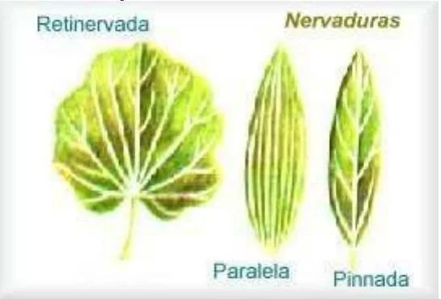 | Tres patrones de nervaduras | P2 M5 | Publicada | [original](parte-02-leer-planta/modulo-05/01_originales/p02-m01-img01-nervaduras-original.jpg) · [recorte](parte-02-leer-planta/modulo-05/02_recortes/p02-m01-img01-nervaduras-recorte.jpg) · [web](parte-02-leer-planta/modulo-05/03_web/p02-m01-img01-nervaduras-web.webp) |
| p02-m02-img01 | 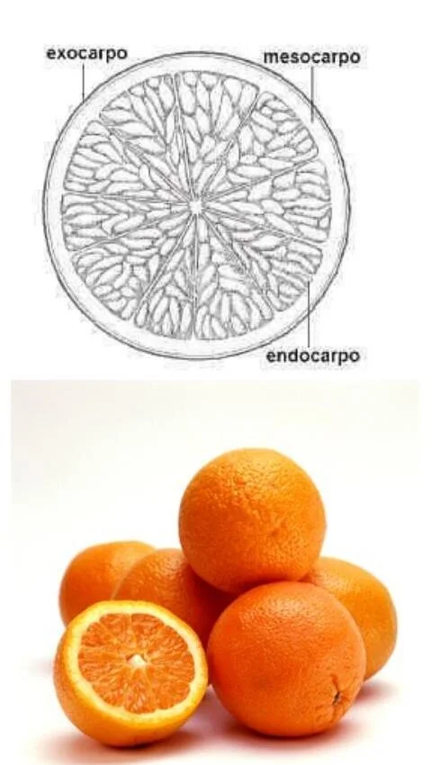 | Anatomía de un hesperidio | P2 M6 | Publicada | [original](parte-02-leer-planta/modulo-06/01_originales/p02-m02-img01-hesperidio-original.jpg) · [recorte](parte-02-leer-planta/modulo-06/02_recortes/p02-m02-img01-hesperidio-recorte.jpg) · [web](parte-02-leer-planta/modulo-06/03_web/p02-m02-img01-hesperidio-web.webp) |
| p02-m03-img01 | 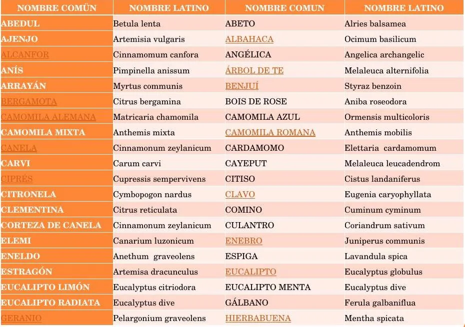 | Nombres comunes y botánicos | P2 M7 | Publicada | [original](parte-02-leer-planta/modulo-07/01_originales/p02-m03-img01-tabla-nombres-original.jpg) · [recorte](parte-02-leer-planta/modulo-07/02_recortes/p02-m03-img01-tabla-nombres-recorte.jpg) · [web](parte-02-leer-planta/modulo-07/03_web/p02-m03-img01-tabla-nombres-web.webp) |
| p02-m04-img01 | 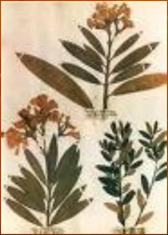 | Pliego de herbario montado | P2 M8 | Publicada | [original](parte-02-leer-planta/modulo-08/01_originales/p02-m04-img01-pliego-herbario-original.jpg) · [recorte](parte-02-leer-planta/modulo-08/02_recortes/p02-m04-img01-pliego-herbario-recorte.jpg) · [web](parte-02-leer-planta/modulo-08/03_web/p02-m04-img01-pliego-herbario-web.webp) |
| p03-m01-img01 | 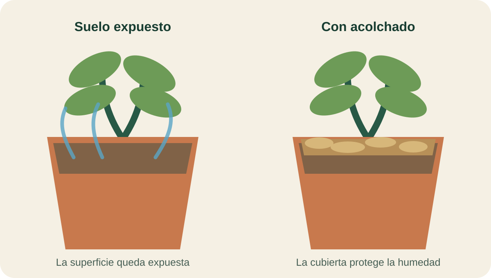 | Macetas con y sin acolchado | P3 M9 | Publicada | [original](parte-03-cultivo/modulo-09/01_originales/p03-m01-img01-acolchado-original.jpg) · [recorte](parte-03-cultivo/modulo-09/02_recortes/p03-m01-img01-acolchado-recorte.svg) · [web](parte-03-cultivo/modulo-09/03_web/p03-m01-img01-acolchado-web.svg) |
| p03-m02-img01 | 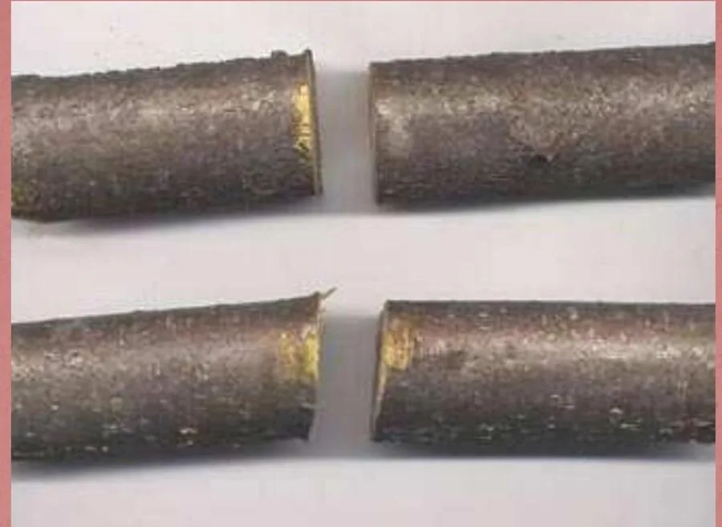 | Cortes con tijeras de paso y de yunque | P3 M10 | Publicada | [original](parte-03-cultivo/modulo-10/01_originales/p03-m02-img01-cortes-tijeras-original.jpg) · [recorte](parte-03-cultivo/modulo-10/02_recortes/p03-m02-img01-cortes-tijeras-recorte.jpg) · [web](parte-03-cultivo/modulo-10/03_web/p03-m02-img01-cortes-tijeras-web.webp) |
| p03-m03-img01 | 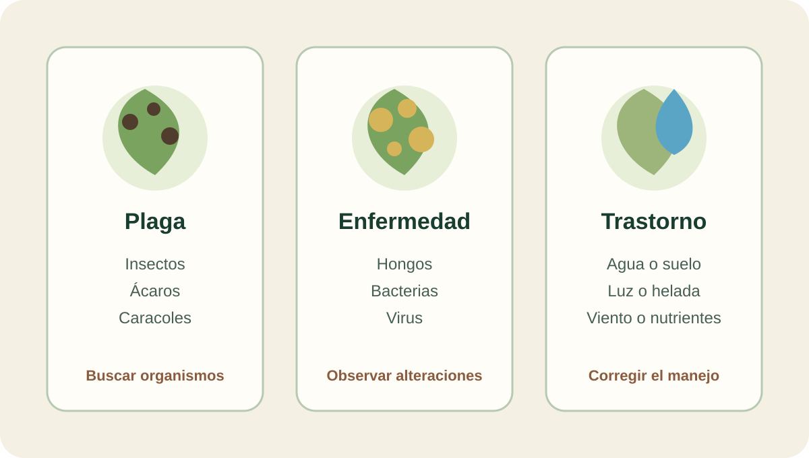 | Diagnóstico del cultivo | P3 M11 | Publicada | [original](parte-03-cultivo/modulo-11/01_originales/p03-m03-img01-diagnostico-cultivo-original.jpg) · [recorte](parte-03-cultivo/modulo-11/02_recortes/p03-m03-img01-diagnostico-cultivo-recorte.svg) · [web](parte-03-cultivo/modulo-11/03_web/p03-m03-img01-diagnostico-cultivo-web.svg) |
| p03-m04-img01 | 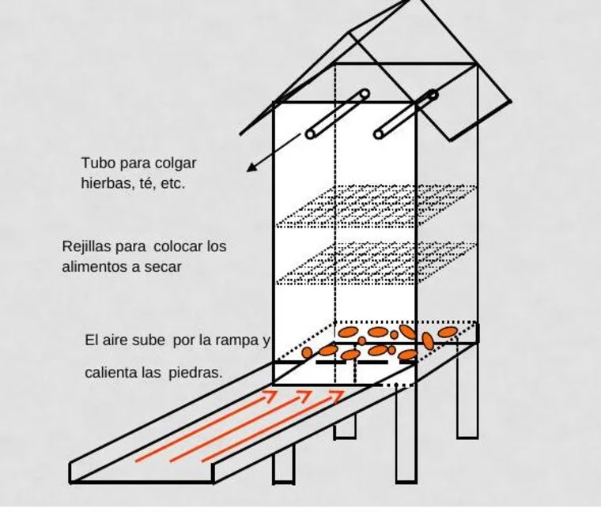 | Secador solar | P3 M12 | Publicada | [original](parte-03-cultivo/modulo-12/01_originales/p03-m04-img01-secador-solar-original.jpg) · [recorte](parte-03-cultivo/modulo-12/02_recortes/p03-m04-img01-secador-solar-recorte.jpg) · [web](parte-03-cultivo/modulo-12/03_web/p03-m04-img01-secador-solar-web.webp) |
| p04-m01-img01 | 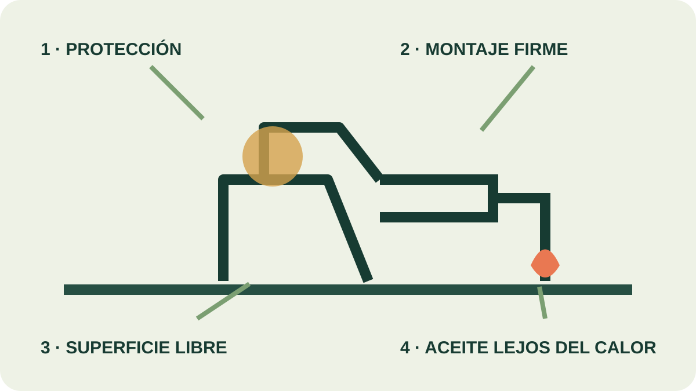 | Puesto seguro de destilación | P4 M13 | Publicada | [original](parte-04-extraccion/modulo-13/01_originales/p04-m01-img01-puesto-seguro-original.svg) · [recorte](parte-04-extraccion/modulo-13/02_recortes/p04-m01-img01-puesto-seguro-recorte.svg) · [web](parte-04-extraccion/modulo-13/03_web/p04-m01-img01-puesto-seguro-web.svg) |
| p04-m02-img01 | 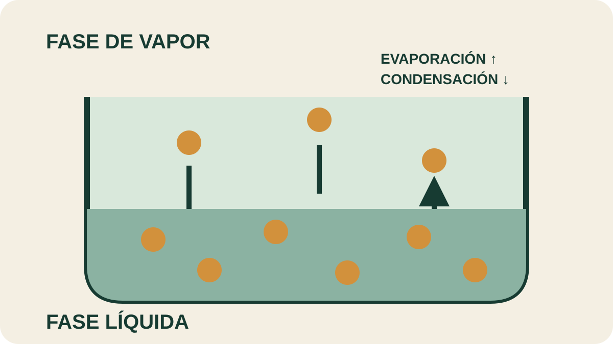 | Equilibrio entre líquido y vapor | P4 M14 | Publicada | [original](parte-04-extraccion/modulo-14/01_originales/p04-m02-img01-equilibrio-vapor-original.svg) · [recorte](parte-04-extraccion/modulo-14/02_recortes/p04-m02-img01-equilibrio-vapor-recorte.svg) · [web](parte-04-extraccion/modulo-14/03_web/p04-m02-img01-equilibrio-vapor-web.svg) |
| p04-m03-img01 | 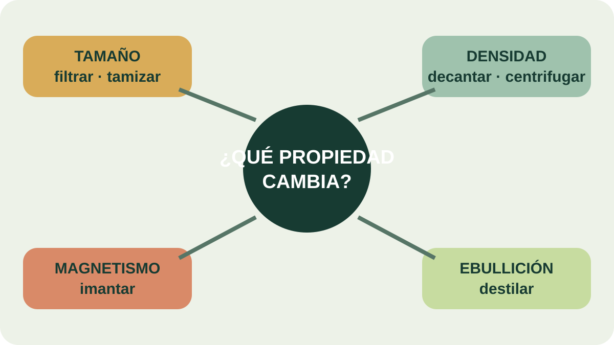 | Mapa de separaciones | P4 M15 | Publicada | [original](parte-04-extraccion/modulo-15/01_originales/p04-m03-img01-mapa-separaciones-original.svg) · [recorte](parte-04-extraccion/modulo-15/02_recortes/p04-m03-img01-mapa-separaciones-recorte.svg) · [web](parte-04-extraccion/modulo-15/03_web/p04-m03-img01-mapa-separaciones-web.svg) |
| p04-m04-img01 | 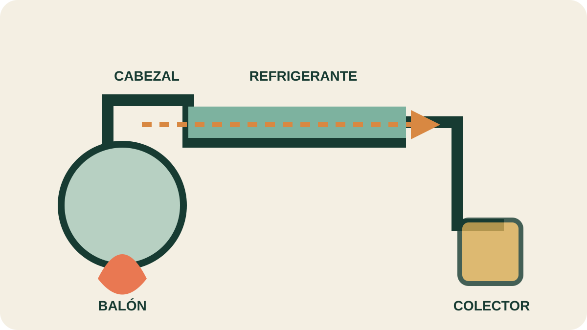 | Recorrido por el alambique | P4 M16 | Publicada | [original](parte-04-extraccion/modulo-16/01_originales/p04-m04-img01-recorrido-alambique-original.svg) · [recorte](parte-04-extraccion/modulo-16/02_recortes/p04-m04-img01-recorrido-alambique-recorte.svg) · [web](parte-04-extraccion/modulo-16/03_web/p04-m04-img01-recorrido-alambique-web.svg) |
| p04-m05-img01 | 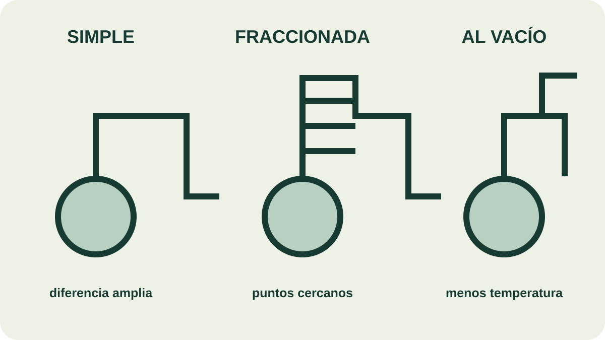 | Tres destilaciones | P4 M17 | Publicada | [original](parte-04-extraccion/modulo-17/01_originales/p04-m05-img01-tres-destilaciones-original.svg) · [recorte](parte-04-extraccion/modulo-17/02_recortes/p04-m05-img01-tres-destilaciones-recorte.svg) · [web](parte-04-extraccion/modulo-17/03_web/p04-m05-img01-tres-destilaciones-web.svg) |
| p04-m06-img01 | 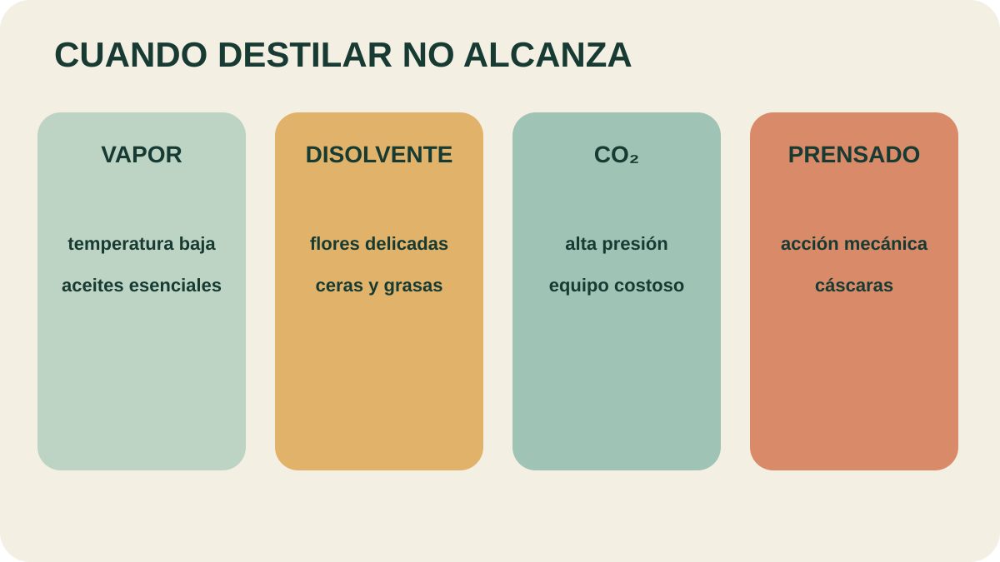 | Métodos alternativos | P4 M18 | Publicada | [original](parte-04-extraccion/modulo-18/01_originales/p04-m06-img01-metodos-alternativos-original.svg) · [recorte](parte-04-extraccion/modulo-18/02_recortes/p04-m06-img01-metodos-alternativos-recorte.svg) · [web](parte-04-extraccion/modulo-18/03_web/p04-m06-img01-metodos-alternativos-web.svg) |
| p04-m07-img01 | 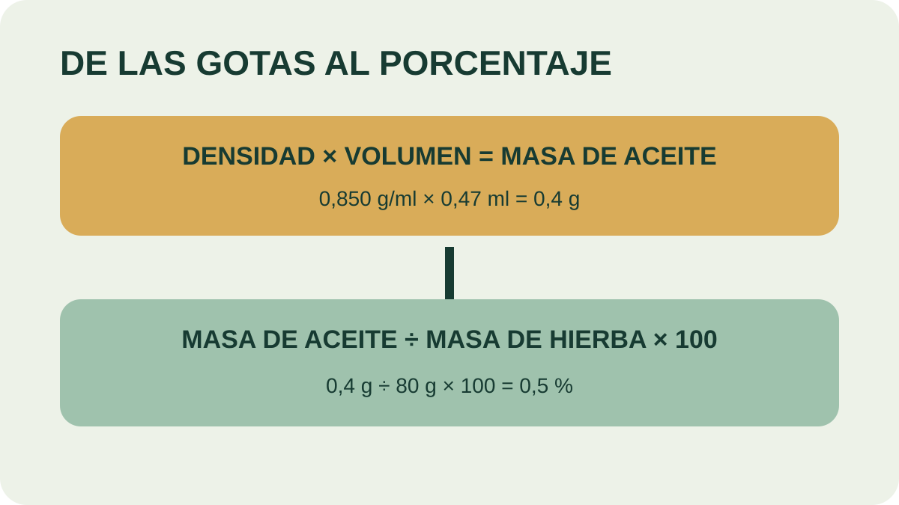 | Cálculo del rendimiento | P4 M19 | Publicada | [original](parte-04-extraccion/modulo-19/01_originales/p04-m07-img01-rendimiento-original.svg) · [recorte](parte-04-extraccion/modulo-19/02_recortes/p04-m07-img01-rendimiento-recorte.svg) · [web](parte-04-extraccion/modulo-19/03_web/p04-m07-img01-rendimiento-web.svg) |
| p05-m01-img01 | 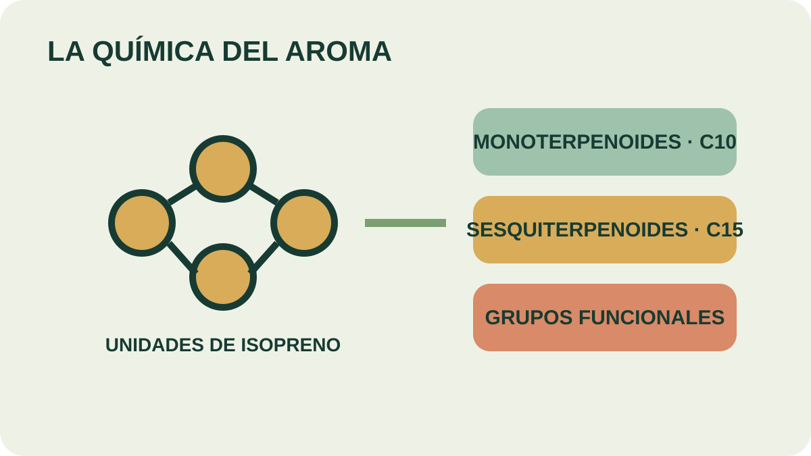 | Familias aromáticas | P5 M20 | Publicada | [original](parte-05-formulacion/modulo-20/01_originales/p05-m01-img01-familias-aromaticas-original.svg) · [recorte](parte-05-formulacion/modulo-20/02_recortes/p05-m01-img01-familias-aromaticas-recorte.svg) · [web](parte-05-formulacion/modulo-20/03_web/p05-m01-img01-familias-aromaticas-web.svg) |
| p05-m02-img01 | 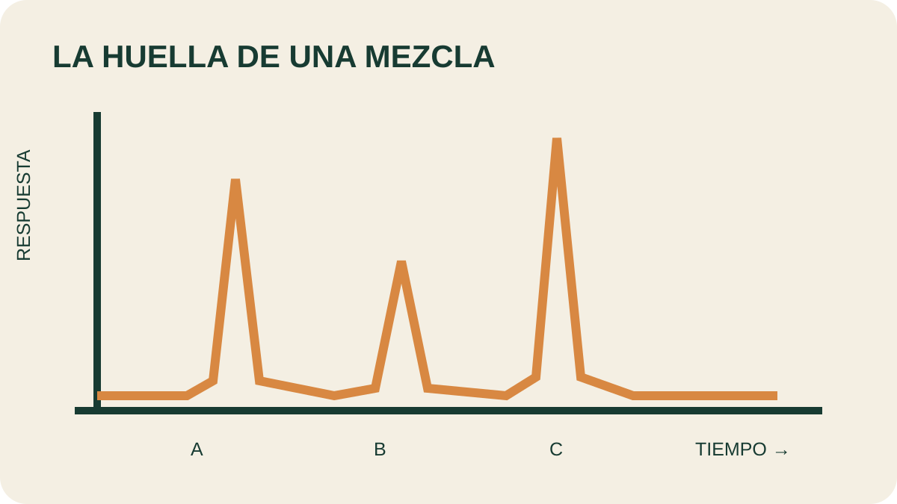 | Cromatograma | P5 M21 | Publicada | [original](parte-05-formulacion/modulo-21/01_originales/p05-m02-img01-cromatograma-original.svg) · [recorte](parte-05-formulacion/modulo-21/02_recortes/p05-m02-img01-cromatograma-recorte.svg) · [web](parte-05-formulacion/modulo-21/03_web/p05-m02-img01-cromatograma-web.svg) |
| p05-m03-img01 | 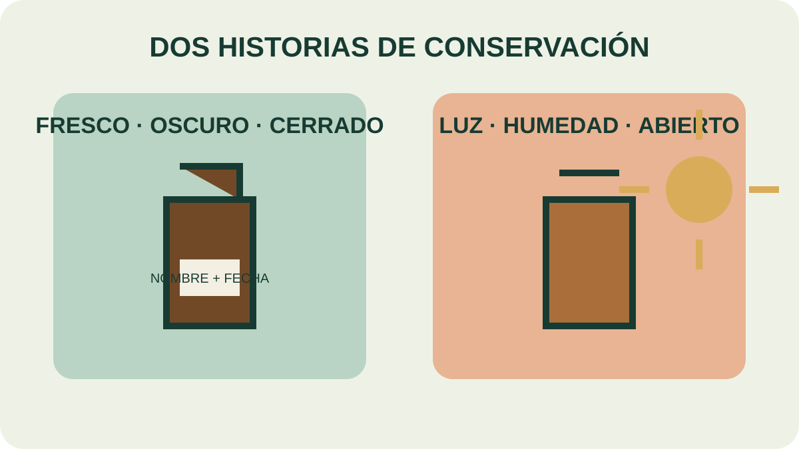 | Conservación comparada | P5 M22 | Publicada | [original](parte-05-formulacion/modulo-22/01_originales/p05-m03-img01-conservacion-original.svg) · [recorte](parte-05-formulacion/modulo-22/02_recortes/p05-m03-img01-conservacion-recorte.svg) · [web](parte-05-formulacion/modulo-22/03_web/p05-m03-img01-conservacion-web.svg) |
| p05-m04-img01 | 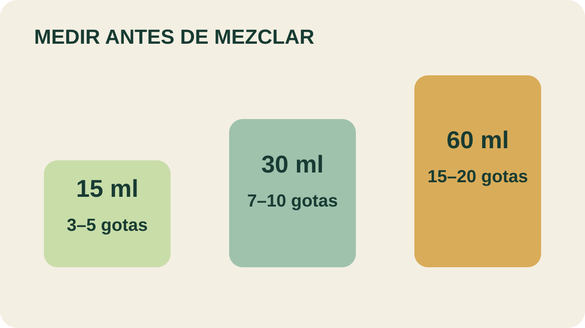 | Escala de dilución | P5 M23 | Publicada | [original](parte-05-formulacion/modulo-23/01_originales/p05-m04-img01-diluciones-original.svg) · [recorte](parte-05-formulacion/modulo-23/02_recortes/p05-m04-img01-diluciones-recorte.svg) · [web](parte-05-formulacion/modulo-23/03_web/p05-m04-img01-diluciones-web.svg) |
| p05-m05-img01 | 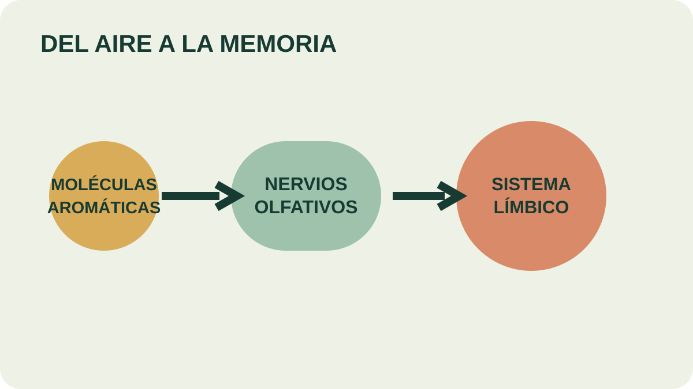 | Ruta olfativa | P5 M24 | Publicada | [original](parte-05-formulacion/modulo-24/01_originales/p05-m05-img01-ruta-olfativa-original.svg) · [recorte](parte-05-formulacion/modulo-24/02_recortes/p05-m05-img01-ruta-olfativa-recorte.svg) · [web](parte-05-formulacion/modulo-24/03_web/p05-m05-img01-ruta-olfativa-web.svg) |
| p05-m06-img01 | 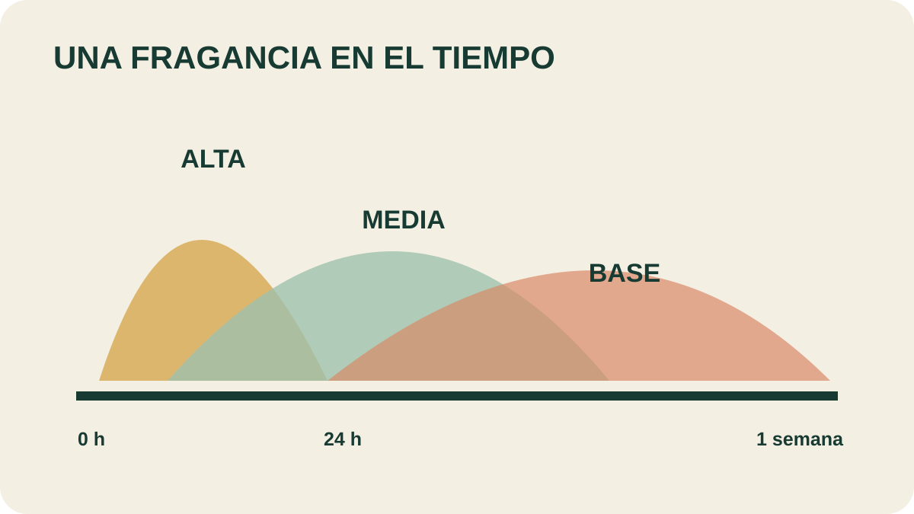 | Línea temporal de notas | P5 M25 | Publicada | [original](parte-05-formulacion/modulo-25/01_originales/p05-m06-img01-linea-notas-original.svg) · [recorte](parte-05-formulacion/modulo-25/02_recortes/p05-m06-img01-linea-notas-recorte.svg) · [web](parte-05-formulacion/modulo-25/03_web/p05-m06-img01-linea-notas-web.svg) |
| p05-m07-img01 | 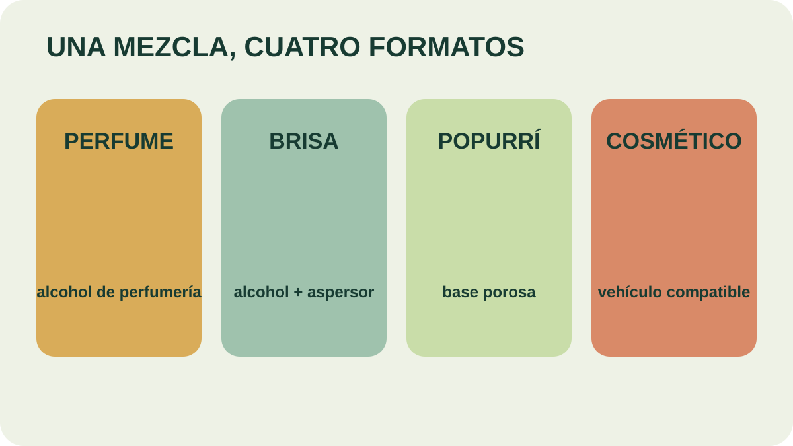 | Cuatro formatos | P5 M26 | Publicada | [original](parte-05-formulacion/modulo-26/01_originales/p05-m07-img01-formatos-original.svg) · [recorte](parte-05-formulacion/modulo-26/02_recortes/p05-m07-img01-formatos-recorte.svg) · [web](parte-05-formulacion/modulo-26/03_web/p05-m07-img01-formatos-web.svg) |
| p05-m08-img01 | 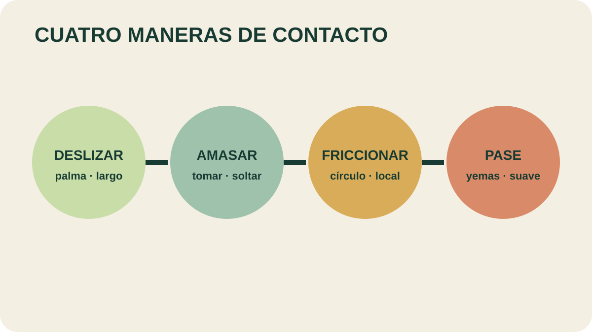 | Maniobras básicas | P5 M27 | Publicada | [original](parte-05-formulacion/modulo-27/01_originales/p05-m08-img01-maniobras-original.svg) · [recorte](parte-05-formulacion/modulo-27/02_recortes/p05-m08-img01-maniobras-recorte.svg) · [web](parte-05-formulacion/modulo-27/03_web/p05-m08-img01-maniobras-web.svg) |
| p05-m09-img01 | 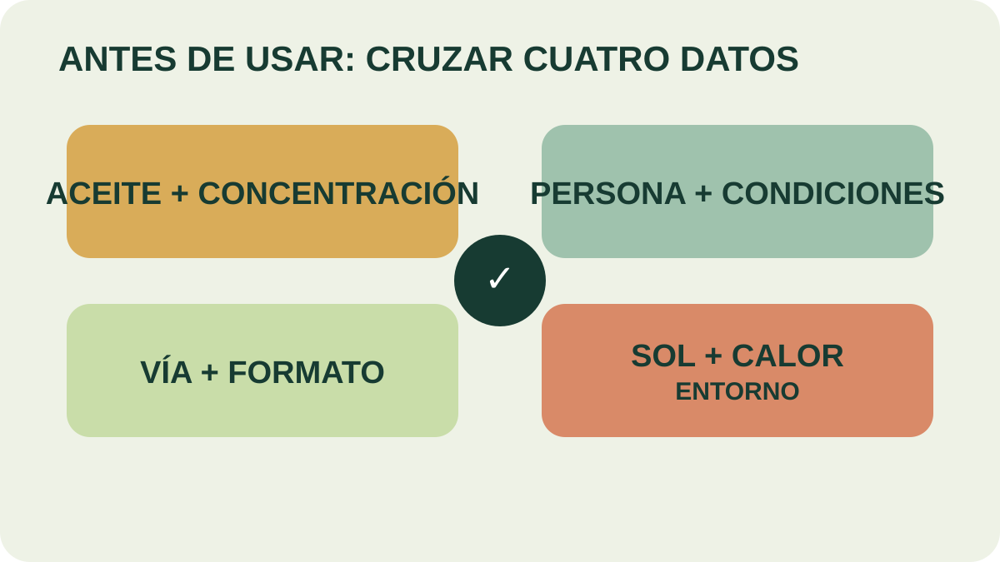 | Matriz de precauciones | P5 M28 | Publicada | [original](parte-05-formulacion/modulo-28/01_originales/p05-m09-img01-matriz-precauciones-original.svg) · [recorte](parte-05-formulacion/modulo-28/02_recortes/p05-m09-img01-matriz-precauciones-recorte.svg) · [web](parte-05-formulacion/modulo-28/03_web/p05-m09-img01-matriz-precauciones-web.svg) |

## Estados admitidos

Candidata · Seleccionada · En recorte · Lista para revisar · Aprobada · Publicada · Reemplazar · Retirada.
