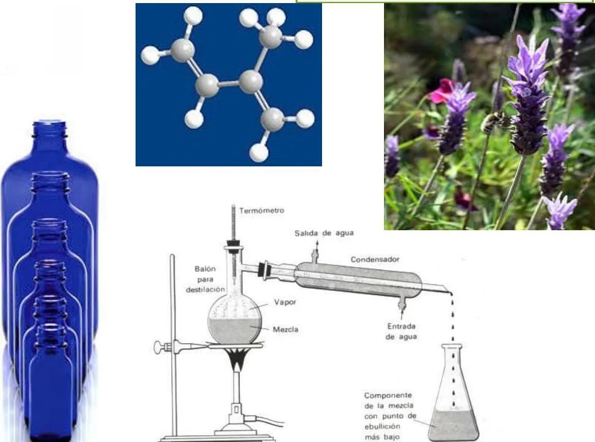
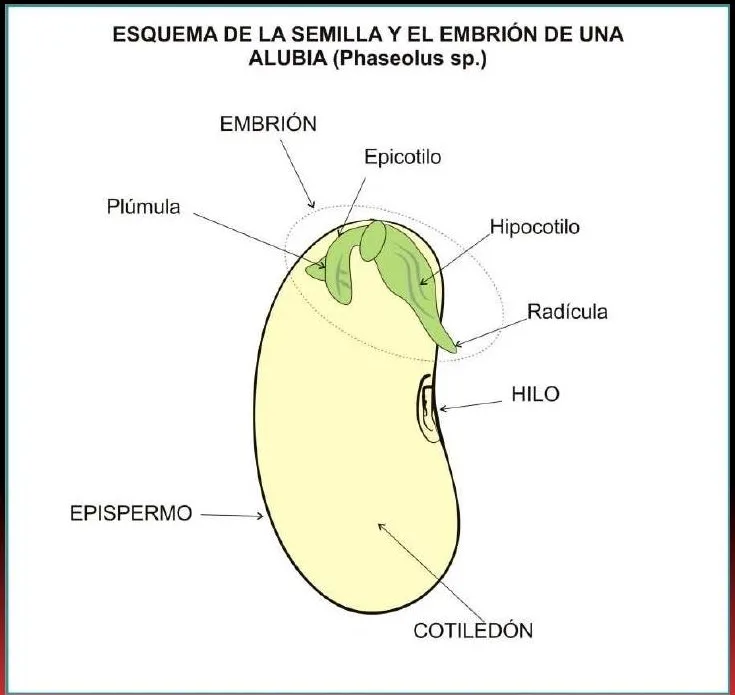
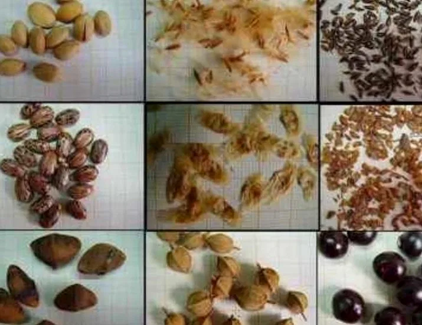
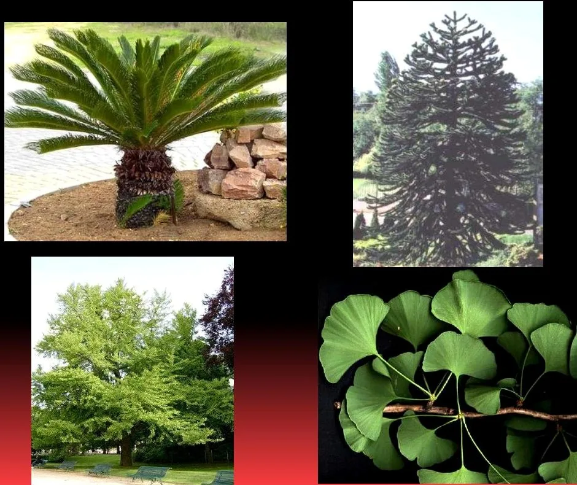
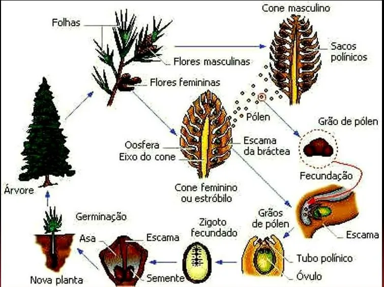
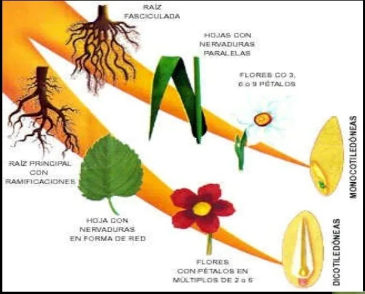
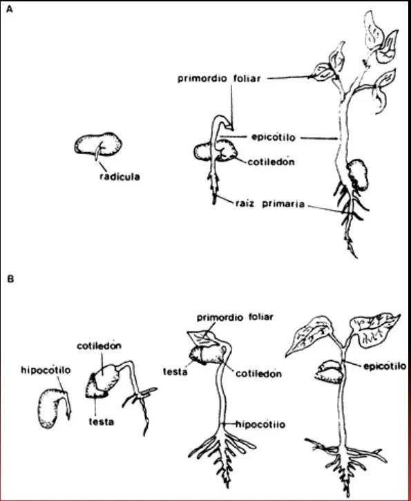

# Inventario de imágenes

Este documento permite revisar cada visual, su tratamiento y su estado editorial. El CSV contiguo contiene todos los campos técnicos.

| ID | Vista | Título | Ubicación | Estado | Archivos |
|---|---|---|---|---|---|
| t01-m01-img01 |  | Mapa de transformación | T1 M1 | Publicada | [original](tema-01-introduccion/01_originales/pagina-09.jpg) · [recorte](tema-01-introduccion/02_recortes/t01-m01-img01-mapa-transformacion-recorte.jpg) · [web](tema-01-introduccion/03_web/t01-m01-img01-mapa-transformacion-web.webp) |
| t01-m02-img01 |  | Frasco con aceite | T1 M2 | Publicada | [original](tema-01-introduccion/01_originales/pagina-01.jpg) · [recorte](tema-01-introduccion/02_recortes/t01-m02-img01-frasco-aceite-recorte.jpg) · [web](tema-01-introduccion/03_web/t01-m02-img01-frasco-aceite-web.webp) |
| t03-m01-img01 |  | Anatomía de una semilla | T3 M1 | Publicada | [original](tema-03-semillas/01_originales/pagina-7.jpg) · [recorte](tema-03-semillas/02_recortes/t03-m01-img01-anatomia-semilla-recorte.jpg) · [web](tema-03-semillas/03_web/t03-m01-img01-anatomia-semilla-web.webp) |
| t03-m01-img02 |  | Diversidad de semillas | T3 M1 | Publicada | [original](tema-03-semillas/01_originales/pagina-8.jpg) · [recorte](tema-03-semillas/02_recortes/t03-m01-img02-diversidad-semillas-recorte.jpg) · [web](tema-03-semillas/03_web/t03-m01-img02-diversidad-semillas-web.webp) |
| t03-m02-img01 |  | Ejemplos de gimnospermas | T3 M2 | Publicada | [original](tema-03-semillas/01_originales/pagina-12.jpg) · [recorte](tema-03-semillas/02_recortes/t03-m02-img01-gimnospermas-recorte.jpg) · [web](tema-03-semillas/03_web/t03-m02-img01-gimnospermas-web.webp) |
| t03-m02-img02 |  | Ciclo de una conífera | T3 M2 | Publicada | [original](tema-03-semillas/01_originales/pagina-16.jpg) · [recorte](tema-03-semillas/02_recortes/t03-m02-img02-ciclo-conifera-recorte.jpg) · [web](tema-03-semillas/03_web/t03-m02-img02-ciclo-conifera-web.webp) |
| t03-m03-img01 |  | Monocotiledóneas y dicotiledóneas | T3 M3 | Publicada | [original](tema-03-semillas/01_originales/pagina-26.jpg) · [recorte](tema-03-semillas/02_recortes/t03-m03-img01-monocotiledoneas-dicotiledoneas-recorte.jpg) · [web](tema-03-semillas/03_web/t03-m03-img01-monocotiledoneas-dicotiledoneas-web.webp) |
| t03-m04-img01 |  | Germinación epígea e hipógea | T3 M4 | Publicada | [original](tema-03-semillas/01_originales/pagina-29.jpg) · [recorte](tema-03-semillas/02_recortes/t03-m04-img01-germinacion-recorte.jpg) · [web](tema-03-semillas/03_web/t03-m04-img01-germinacion-web.webp) |

## Estados admitidos

Candidata · Seleccionada · En recorte · Lista para revisar · Aprobada · Publicada · Reemplazar · Retirada.
