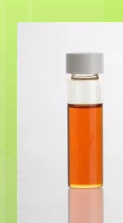
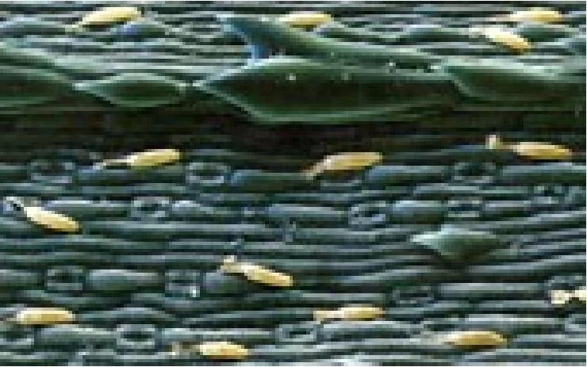
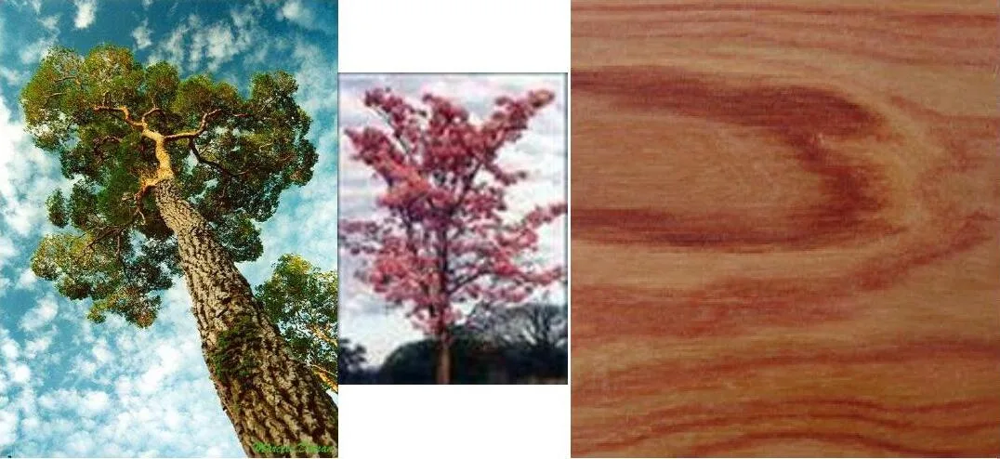
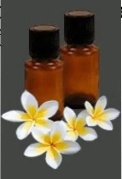

# Inventario de imágenes

| ID | Vista | Título | Ubicación | Estado | Archivos |
|---|---|---|---|---|---|
| t01-m01-img01 |  | Mapa de transformación | P1 M1 | Publicada | [original](tema-01-introduccion/01_originales/pagina-09.jpg) · [recorte](tema-01-introduccion/02_recortes/t01-m01-img01-mapa-transformacion-recorte.jpg) · [web](tema-01-introduccion/03_web/t01-m01-img01-mapa-transformacion-web.webp) |
| t01-m02-img01 |  | Frasco con aceite | P1 M2 | Publicada | [original](tema-01-introduccion/01_originales/pagina-01.jpg) · [recorte](tema-01-introduccion/02_recortes/t01-m02-img01-frasco-aceite-recorte.jpg) · [web](tema-01-introduccion/03_web/t01-m02-img01-frasco-aceite-web.webp) |
| t03-m01-img01 |  | Anatomía de una semilla | P1 M1 | Publicada | [original](tema-03-semillas/01_originales/pagina-7.jpg) · [recorte](tema-03-semillas/02_recortes/t03-m01-img01-anatomia-semilla-recorte.jpg) · [web](tema-03-semillas/03_web/t03-m01-img01-anatomia-semilla-web.webp) |
| t03-m01-img02 |  | Diversidad de semillas | P1 M1 | Publicada | [original](tema-03-semillas/01_originales/pagina-8.jpg) · [recorte](tema-03-semillas/02_recortes/t03-m01-img02-diversidad-semillas-recorte.jpg) · [web](tema-03-semillas/03_web/t03-m01-img02-diversidad-semillas-web.webp) |
| t03-m02-img01 |  | Ejemplos de gimnospermas | P1 M2 | Publicada | [original](tema-03-semillas/01_originales/pagina-12.jpg) · [recorte](tema-03-semillas/02_recortes/t03-m02-img01-gimnospermas-recorte.jpg) · [web](tema-03-semillas/03_web/t03-m02-img01-gimnospermas-web.webp) |
| t03-m02-img02 |  | Ciclo de una conífera | P1 M2 | Publicada | [original](tema-03-semillas/01_originales/pagina-16.jpg) · [recorte](tema-03-semillas/02_recortes/t03-m02-img02-ciclo-conifera-recorte.jpg) · [web](tema-03-semillas/03_web/t03-m02-img02-ciclo-conifera-web.webp) |
| t03-m03-img01 |  | Monocotiledóneas y dicotiledóneas | P1 M3 | Publicada | [original](tema-03-semillas/01_originales/pagina-26.jpg) · [recorte](tema-03-semillas/02_recortes/t03-m03-img01-monocotiledoneas-dicotiledoneas-recorte.jpg) · [web](tema-03-semillas/03_web/t03-m03-img01-monocotiledoneas-dicotiledoneas-web.webp) |
| t03-m04-img01 |  | Germinación epígea e hipógea | P1 M4 | Publicada | [original](tema-03-semillas/01_originales/pagina-29.jpg) · [recorte](tema-03-semillas/02_recortes/t03-m04-img01-germinacion-recorte.jpg) · [web](tema-03-semillas/03_web/t03-m04-img01-germinacion-web.webp) |
| p01-m01-img01 |  | Frasco ámbar | P1 M1 | Publicada | [original](tema-01-introduccion/01_originales/pagina-01.jpg) · [recorte](tema-01-introduccion/02_recortes/t01-m02-img01-frasco-aceite-recorte.jpg) · [web](parte-01-la-gota/modulo-01/03_web/p01-m01-img01-frasco-ambar-web.webp) |
| p01-m02-img01 |  | Glándulas de citronela | P1 M2 | Publicada | [original](parte-01-la-gota/modulo-02/01_originales/p01-m02-img01-glandulas-citronela-original.jpg) · [recorte](parte-01-la-gota/modulo-02/02_recortes/p01-m02-img01-glandulas-citronela-recorte.jpg) · [web](parte-01-la-gota/modulo-02/03_web/p01-m02-img01-glandulas-citronela-web.webp) |
| p01-m03-img01 |  | Palo rosa en tres escalas | P1 M3 | Publicada | [original](parte-01-la-gota/modulo-03/01_originales/p01-m03-img01-palo-rosa-original.jpg) · [recorte](parte-01-la-gota/modulo-03/02_recortes/p01-m03-img01-palo-rosa-recorte.jpg) · [web](parte-01-la-gota/modulo-03/03_web/p01-m03-img01-palo-rosa-web.webp) |
| p01-m04-img01 |  | Frascos y flores | P1 M4 | Publicada | [original](parte-01-la-gota/modulo-04/01_originales/p01-m04-img01-frascos-precaucion-original.jpg) · [recorte](parte-01-la-gota/modulo-04/02_recortes/p01-m04-img01-frascos-precaucion-recorte.jpg) · [web](parte-01-la-gota/modulo-04/03_web/p01-m04-img01-frascos-precaucion-web.webp) |

## Estados admitidos

Candidata · Seleccionada · En recorte · Lista para revisar · Aprobada · Publicada · Reemplazar · Retirada.
